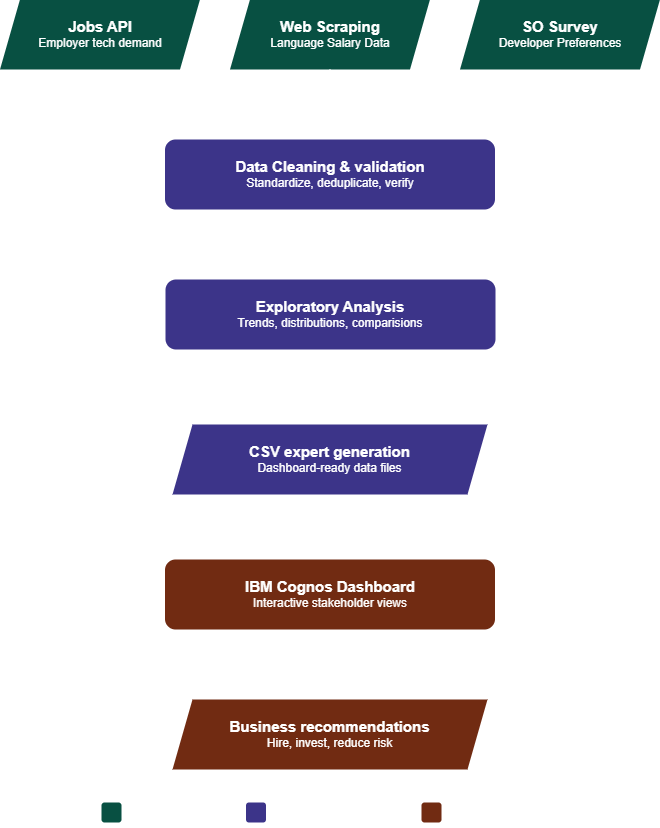
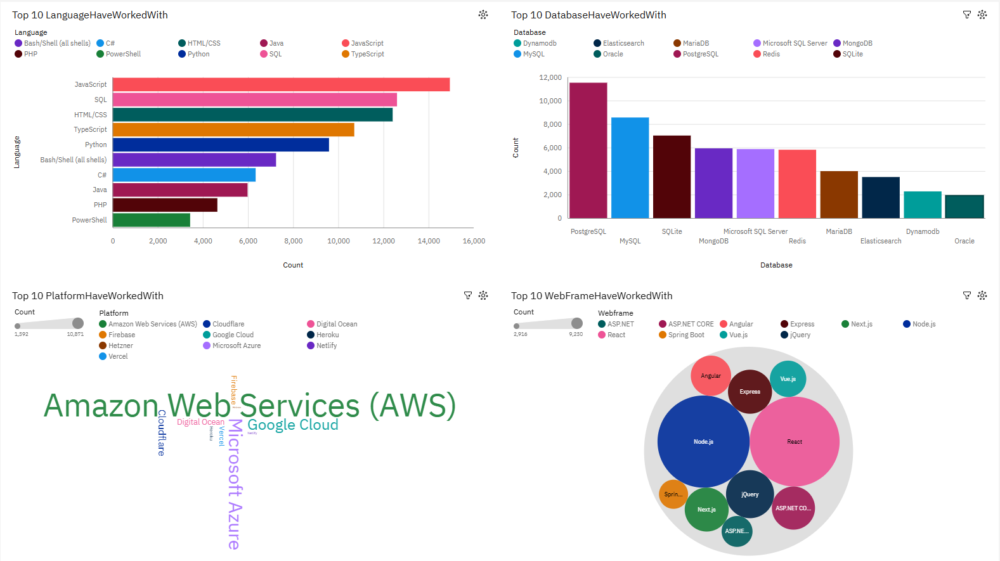
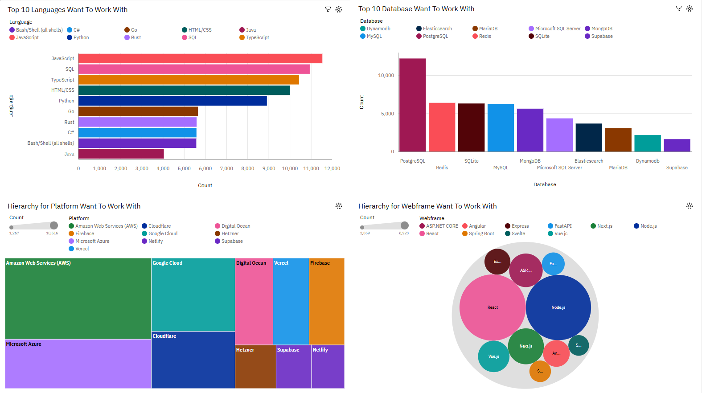
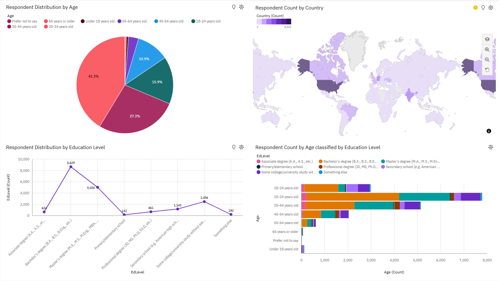

# Developer Ecosystem Analysis 2024

A comprehensive technology trend analysis pipeline that combines job market demand, salary data, and developer survey insights to identify current and emerging technologies across the software industry.


**[Portfolio](https://derrickscottux-collab.github.io/) · [LinkedIn](https://www.linkedin.com/in/derrick-scott-980109236/)**

---

## Overview

This project started as the capstone assignment for the IBM Data Analytics Professional Certificate, but I expanded it significantly beyond the original course requirements.

Rather than treating the capstone as a collection of separate exercises, I built a consolidated analysis notebook that brings together all three required data collection methods into a single workflow:

- REST API data collection for technology job postings
- Web scraping for programming language salary data
- Survey processing and analysis using the 2024 Stack Overflow Developer Survey

The final presentation was redesigned as a portfolio project rather than a standard course submission.

The intended audience for this analysis includes hiring managers, technical leaders, workforce planners, and organizations evaluating technology investments or employee upskilling initiatives. Findings are structured to support data-driven decisions about technology adoption, hiring priorities, and future skill development.

---

## Business Question

**Which technologies are developers using today, and which technologies do they want to use next year?**

This project examines current adoption and future demand across:

- Programming Languages
- Databases
- Cloud Platforms
- Web Frameworks

The goal is to identify technologies that organizations should hire for, invest in, or monitor as part of long-term technology strategy.

---

## Why This Matters

Technology decisions influence hiring costs, training investments, productivity, and long-term maintainability.

This analysis helps stakeholders:

- Identify technologies with strong long-term momentum
- Understand which skills are becoming baseline industry expectations
- Spot emerging technologies before widespread adoption
- Reduce hiring risk associated with declining technology stacks
- Prioritize employee upskilling initiatives

---

## Pipeline Architecture



```text
Jobs API → Web Scraping → Stack Overflow Survey Data
     → Data Cleaning & Validation
     → Exploratory Analysis
     → CSV Export Generation
     → IBM Cognos Dashboard
     → Business Recommendations
```

Each stage has a clear input and output. Nothing downstream runs without the stage before it completing cleanly.

---

## Features

- Multi-source data collection using APIs, web scraping, and survey datasets
- Unified analysis notebook that combines all project components into a single workflow
- Technology trend analysis across programming languages, databases, cloud platforms, and web frameworks
- Current vs future adoption comparisons to identify emerging technologies
- Interactive IBM Cognos dashboards for stakeholder-focused reporting
- Demographic analysis exploring age, education, and geographic distribution
- Portfolio-focused presentation designed for professional audiences rather than coursework evaluation

---

## Dashboard Screenshots

### Dashboard Tab 1: Current Technology Usage



### Dashboard Tab 2: Future Technology Trends



### Dashboard Tab 3: Developer Demographics



---

## Business Questions Answered

- Which programming languages are most widely used today?
- Which technologies are gaining momentum among developers?
- Which databases are most likely to see future adoption growth?
- Which cloud platforms are strongest in both current and future usage?
- Which frameworks should organizations invest in for long-term relevance?
- What technologies may present future hiring and maintenance risks?

## Key Findings

### Programming Languages

- JavaScript remains the most widely used language with nearly 15,000 respondents
- TypeScript continues gaining adoption and ranks among the most desired languages
- Go and Rust emerged as major growth technologies in future preference rankings
- HTML/CSS usage remains high but future interest shows signs of decline

### Databases

- PostgreSQL ranks #1 in both current and desired usage
- Desired PostgreSQL adoption exceeds current adoption, signaling continued growth
- Redis shows one of the largest jumps in future demand
- Supabase appears as a new entrant among desired technologies

### Cloud Platforms

- AWS remains the dominant cloud platform
- Microsoft Azure and Google Cloud maintain strong enterprise adoption
- Cloudflare shows the strongest growth among established cloud providers
- Supabase enters the future rankings as a growing platform ecosystem

### Web Frameworks

- React and Node.js remain the dominant technologies
- Next.js continues gaining momentum
- FastAPI and Svelte appear among future-focused technologies
- jQuery disappears from desired rankings, signaling long-term decline

---

## Business Recommendations

### Hire for the Core Stack

TypeScript, PostgreSQL, and AWS rank highly in both current and desired usage. These technologies have become baseline expectations across much of the industry.

### Invest in Emerging Technologies

Go, Rust, FastAPI, Next.js, and Cloudflare demonstrate strong growth signals. Organizations investing early may gain competitive advantages in hiring and development efficiency.

### Reduce Legacy Risk

jQuery, PHP, Oracle, and Heroku show declining future interest. Organizations heavily dependent on these technologies may face increased hiring and maintenance challenges over time.

---

## Project Structure

```text
ibm-data-analyst-capstone/
│
├── notebooks/
│   └── IBM_Capstone_Full_Analysis.ipynb
│
├── data/
│   ├── popular-languages.csv
│   ├── job-postings.xlsx
│   └── job-skills.xlsx
│
├── exports/
│   ├── tab_1_csv_language_top10.csv
│   ├── tab_1_csv_database_top10.csv
│   ├── tab_1_csv_platform_top10.csv
│   ├── tab_1_csv_webframe_top10.csv
│   ├── tab_2_csv_language_want_top10.csv
│   ├── tab_2_csv_database_want_top10.csv
│   ├── tab_2_csv_platform_want_top10.csv
│   └── tab_2_csv_webframe_want_top10.csv
│
├── images/
│   ├── workflow-diagram.png
│   ├── current_tech_usage.png
│   ├── future_tech_trend.png
│   └── demographics.png
│
├── presentation/
│   └── Developer_Ecosystem_Analysis_2024.pdf
│
├── README.md
└── requirements.txt
```

---

## Data Collection Methods

| Method | Purpose | Output |
|----------|----------|----------|
| Jobs API | Analyze employer demand by technology and location | Job posting datasets |
| Web Scraping | Collect programming language salary information | Salary comparison dataset |
| Survey Analysis | Analyze technology usage and future preferences | Dashboard-ready CSV exports |

---

## Technologies Used

### Data Analysis

- Python
- Pandas
- NumPy
- OpenPyXL

### Data Collection

- Requests
- BeautifulSoup

### Visualization & Reporting

- IBM Cognos Analytics
- Jupyter Notebook

---

## Getting Started

### Install dependencies

```bash
pip install -r requirements.txt
```

### Run

1. Clone the repo
   ```bash
   git clone https://github.com/derrickscottux-collab/ibm-data-analyst-capstone.git
   ```
2. Open `notebooks/IBM_Capstone_Full_Analysis.ipynb` in Jupyter or VS Code
3. Run all cells — **Kernel → Restart & Run All**

All exports and dashboard-ready CSVs will regenerate automatically.

---

## Project Deliverables

- End-to-end analysis notebook
- Multi-source data collection pipeline
- Processed datasets and exports
- IBM Cognos dashboard
- Executive-style presentation
- Business recommendations and technology trend analysis

---

## Origin

Originally developed as the IBM Data Analyst Professional Certificate Capstone Project.

The portfolio version extends the original coursework by consolidating all project phases into a single end-to-end workflow and redesigning the presentation to communicate findings to hiring managers, technical leaders, and business stakeholders.

---

## Author

**Derrick Scott**

[Portfolio](https://derrickscottux-collab.github.io/)
| [LinkedIn](https://www.linkedin.com/in/derrick-scott-980109236/)
| [GitHub](https://github.com/derrickscottux-collab)

---

## Certificate

IBM Data Analyst Professional Certificate

https://coursera.org/share/7ff1b11bbe1327c2e8d815bbcdf52150
